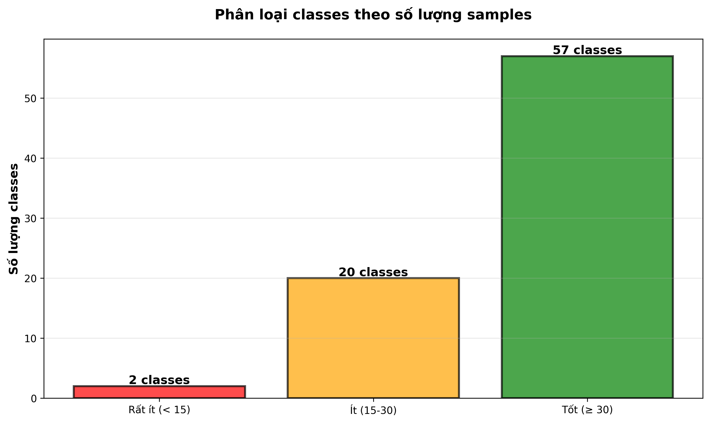
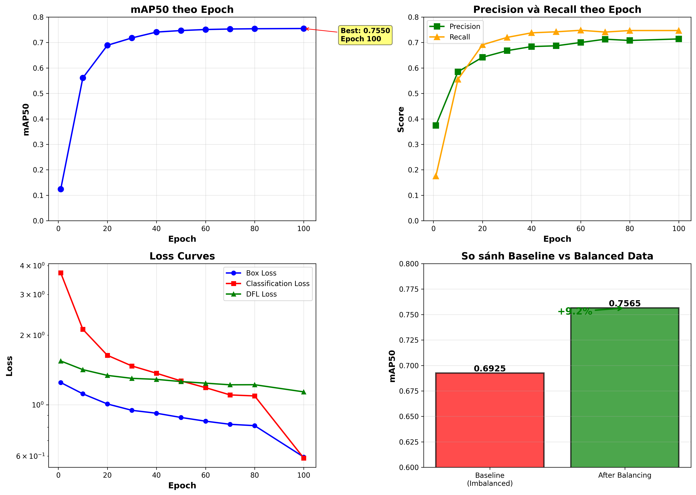

# BÁO CÁO ĐỒ ÁN MÔN DATA MINING

## TRANG BÌA

**TRƯỜNG ĐẠI HỌC TÂN TẠO**  
**KHOA CÔNG NGHỆ THÔNG TIN**  
**BỘ MÔN DATA MINING**

---

**TÊN ĐỀ TÀI:**  
**"Hệ thống nhận diện động vật sử dụng YOLO và ứng dụng web"**

---

**Sinh viên thực hiện:** Phan Văn Tài  
**Mã số sinh viên:** 2202081  
**Giảng viên hướng dẫn:** Tiến sĩ Trần Ngọc Anh  

**Ngày nộp:** [Bạn tự cập nhật]

---

## LỜI CẢM ƠN

Em xin chân thành cảm ơn Tiến sĩ Trần Ngọc Anh - giảng viên hướng dẫn đã tận tình hướng dẫn, chỉ bảo và đóng góp những ý kiến quý báu trong suốt quá trình thực hiện đề tài.

Em cũng xin cảm ơn các thầy cô trong khoa Công nghệ Thông tin đã tạo điều kiện và hỗ trợ em trong quá trình học tập và nghiên cứu.

Cuối cùng, em xin cảm ơn gia đình và bạn bè đã động viên, hỗ trợ em hoàn thành đề tài này.

---

## MỤC LỤC

1. [Tóm tắt (Abstract)](#1-tóm-tắt-abstract)
2. [Giới thiệu đề tài (Introduction)](#2-giới-thiệu-đề-tài-introduction)
3. [Cơ sở lý thuyết (Background / Related Work)](#3-cơ-sở-lý-thuyết-background--related-work)
4. [Phân tích yêu cầu](#4-phân-tích-yêu-cầu)
5. [Thiết kế hệ thống](#5-thiết-kế-hệ-thống)
6. [Chuẩn bị dữ liệu (Data Preparation)](#6-chuẩn-bị-dữ-liệu-data-preparation)
7. [Huấn luyện mô hình (Training)](#7-huấn-luyện-mô-hình-training)
8. [Kết quả (Results)](#8-kết-quả-results)
9. [Demo / Ứng dụng (Deployment)](#9-demo--ứng-dụng-deployment)
10. [Đánh giá & Thảo luận](#10-đánh-giá--thảo-luận)
11. [Kết luận & Hướng phát triển](#11-kết-luận--hướng-phát-triển)
12. [Tài liệu tham khảo](#12-tài-liệu-tham-khảo)

---

## 1. TÓM TẮT (ABSTRACT)

Phát hiện đối tượng là một bài toán quan trọng trong thị giác máy tính. Đề tài xây dựng hệ thống nhận diện động vật sử dụng YOLOv8, một mô hình one-stage detection hiện đại, kết hợp với ứng dụng web để triển khai thực tế.

Vấn đề chính cần giải quyết là xử lý dataset mất cân bằng nghiêm trọng (imbalance ratio ban đầu rất cao, sau khi thu thập và lọc là 73:1) và đạt độ chính xác cao trên 80 lớp động vật khác nhau. Phương pháp áp dụng bao gồm xây dựng pipeline xử lý dữ liệu chuyên nghiệp (oversampling, stratified split), và huấn luyện mô hình YOLOv8n với cấu hình tối ưu cho dữ liệu đã cân bằng.

Kết quả đạt được: mAP50 = **0.7565** (75.65%), mAP50-95 = **0.6322** (63.22%), Precision = **0.7140**, Recall = **0.7469**. Hệ thống đã cải thiện **+9.2%** so với baseline sử dụng dữ liệu mất cân bằng (0.6925). Ứng dụng web được xây dựng với React frontend và FastAPI backend, hỗ trợ nhận diện đơn lẻ và batch, tùy chỉnh thresholds, và hiển thị thống kê chi tiết.

---

## 2. GIỚI THIỆU ĐỀ TÀI (INTRODUCTION)

### 2.1. Bối cảnh

Phát hiện đối tượng (Object Detection) là một trong những bài toán cơ bản và quan trọng nhất trong thị giác máy tính, có nhiều ứng dụng thực tế:

- **Giao thông**: Phát hiện phương tiện, người đi bộ, biển báo
- **Giám sát**: Camera an ninh, theo dõi hành vi bất thường
- **Y tế**: Phát hiện bất thường trong hình ảnh y khoa
- **Nông nghiệp**: Nhận diện sâu bệnh, động vật gây hại
- **Bảo tồn**: Theo dõi và bảo vệ động vật hoang dã

Nhận diện động vật đặc biệt quan trọng trong các lĩnh vực bảo tồn thiên nhiên, nghiên cứu hành vi động vật, và quản lý động vật trong các khu bảo tồn, vườn thú.

### 2.2. Vấn đề cần giải quyết

1. **Dataset mất cân bằng nghiêm trọng**: Một số lớp có rất nhiều mẫu (ví dụ: Butterfly với 2,045 ảnh), trong khi một số lớp có rất ít (ví dụ: Squid chỉ có 28 ảnh), dẫn đến imbalance ratio sau khi thu thập và lọc là 73:1.

2. **Đa lớp phức tạp**: Hệ thống cần nhận diện 80 lớp động vật khác nhau với đặc trưng hình thái và môi trường sống đa dạng.

3. **Yêu cầu độ chính xác cao**: Cần đạt mAP50 ≥ 0.75 để đảm bảo tính thực tiễn của hệ thống.

4. **Triển khai thực tế**: Xây dựng ứng dụng web dễ sử dụng để người dùng có thể upload ảnh và nhận kết quả ngay lập tức.

### 2.3. Mục tiêu đề tài

- Xây dựng pipeline xử lý dữ liệu chuyên nghiệp để cân bằng dataset và cải thiện chất lượng dữ liệu.
- Huấn luyện mô hình YOLOv8 đạt mAP50 ≥ 0.75 trên 80 lớp động vật.
- Phát triển ứng dụng web với giao diện thân thiện, dễ sử dụng.
- Hỗ trợ nhận diện đơn lẻ và batch, tùy chỉnh thresholds để tối ưu kết quả.

### 2.4. Phạm vi đề tài

- Chỉ phát hiện trong ảnh tĩnh (không xử lý video).
- Không thực hiện tracking đối tượng.
- Tập trung vào 80 lớp động vật từ dataset Animals Detection Images Dataset.
- Không xử lý real-time streaming.

---

## 3. CƠ SỞ LÝ THUYẾT (BACKGROUND / RELATED WORK)

### 3.1. Phát hiện đối tượng (Object Detection)

Phát hiện đối tượng là bài toán kết hợp hai nhiệm vụ:
- **Localization**: Xác định vị trí của đối tượng trong ảnh (bounding box).
- **Classification**: Phân loại đối tượng thuộc lớp nào.

Có hai hướng tiếp cận chính:

**Two-stage detectors:**
- R-CNN, Fast R-CNN, Faster R-CNN
- Ưu điểm: Độ chính xác cao
- Nhược điểm: Tốc độ chậm

**One-stage detectors:**
- YOLO, SSD, RetinaNet
- Ưu điểm: Tốc độ nhanh, phù hợp real-time
- Nhược điểm: Độ chính xác thấp hơn two-stage (nhưng đã được cải thiện đáng kể)

### 3.2. YOLO (You Only Look Once)

#### 3.2.1. Lịch sử phát triển

- **YOLOv1 (2016)**: Mô hình one-stage đầu tiên, nhanh nhưng độ chính xác thấp.
- **YOLOv2/YOLO9000**: Cải thiện với anchor boxes, batch normalization.
- **YOLOv3**: Multi-scale detection, sử dụng Darknet-53 backbone.
- **YOLOv4**: Tích hợp nhiều kỹ thuật: CSPDarknet, PANet, nhiều kỹ thuật augmentation.
- **YOLOv5**: Được viết bằng PyTorch, dễ sử dụng và tùy chỉnh.
- **YOLOv8 (2023)**: Phiên bản mới nhất với kiến trúc anchor-free, C2f module, đạt tốc độ và độ chính xác tốt nhất.

#### 3.2.2. Kiến trúc YOLOv8

YOLOv8 bao gồm 3 phần chính:

1. **Backbone**: CSPDarknet với C2f module
2. **Neck**: PANet (Path Aggregation Network)
3. **Head**: Decoupled head (tách riêng classification và regression)

**C2f Module:**
- Kết hợp ưu điểm của C3 và ELAN
- Gradient flow tốt hơn
- Tăng khả năng học đặc trưng

**SPPF (Spatial Pyramid Pooling Fast):**
- Thay thế SPP truyền thống
- Tăng tốc độ xử lý
- Giữ được khả năng đa tỷ lệ

**Anchor-free:**
- Không sử dụng anchor boxes
- Dự đoán trực tiếp center và kích thước
- Giảm số lượng tham số, tăng tốc độ

### 3.3. Loss Functions

YOLOv8 sử dụng 3 loại loss:

1. **Box Loss (CIoU)**:
   - Kết hợp IoU, khoảng cách center, và aspect ratio
   - Công thức: L_box = 1 - CIoU

2. **Classification Loss (BCE)**:
   - Binary Cross Entropy
   - Hỗ trợ multi-label classification

3. **DFL Loss (Distribution Focal Loss)**:
   - Dự đoán phân phối xác suất thay vì giá trị trực tiếp
   - Tăng độ chính xác localization

### 3.4. Non-Maximum Suppression (NMS)

NMS loại bỏ các bounding boxes trùng lặp:

1. Sắp xếp các boxes theo confidence giảm dần
2. Chọn box có confidence cao nhất
3. Loại bỏ tất cả boxes có IoU > threshold với box đã chọn
4. Lặp lại cho đến khi không còn box nào

### 3.5. Metrics đánh giá

#### 3.5.1. Precision và Recall

- **Precision** = TP / (TP + FP): Tỷ lệ dự đoán đúng trong tất cả dự đoán
- **Recall** = TP / (TP + FN): Tỷ lệ phát hiện được trong tất cả đối tượng thực tế

#### 3.5.2. IoU (Intersection over Union)

IoU = (Area of Overlap) / (Area of Union)

- IoU > 0.5: Thường được coi là detection đúng
- IoU > 0.7: Detection tốt
- IoU > 0.9: Detection rất tốt

#### 3.5.3. mAP (mean Average Precision)

- **AP (Average Precision)**: Diện tích dưới Precision-Recall curve
- **mAP**: Trung bình AP của tất cả các classes
- **mAP50**: mAP với IoU threshold = 0.5
- **mAP50-95**: Trung bình mAP từ IoU 0.5 đến 0.95 (bước 0.05)

#### 3.5.4. F1-Score

F1 = 2 × (Precision × Recall) / (Precision + Recall)

### 3.6. Dataset Format

#### 3.6.1. YOLO Format

Mỗi ảnh có một file .txt tương ứng với format:
```
class_id center_x center_y width height
```

- Tất cả tọa độ được normalized về [0, 1]
- center_x, center_y: Tọa độ tâm của bounding box
- width, height: Chiều rộng và chiều cao của bounding box

Ví dụ:
```
0 0.5 0.5 0.3 0.4
1 0.2 0.3 0.1 0.2
```

#### 3.6.2. COCO Format

Format JSON với các trường:
- images: Thông tin về các ảnh
- annotations: Bounding boxes và labels
- categories: Danh sách các classes

### 3.7. Data Augmentation

Các kỹ thuật tăng cường dữ liệu:

- **Geometric**: Rotation, translation, scaling, flipping
- **Color**: Brightness, contrast, saturation, hue
- **Advanced**: Mosaic, mixup, copy-paste

Lưu ý: Augmentation quá mạnh có thể làm giảm độ chính xác với dữ liệu đã cân bằng.

---

## 4. PHÂN TÍCH YÊU CẦU

### 4.1. Yêu cầu chức năng

1. Nhận diện động vật trong ảnh tĩnh
2. Vẽ bounding boxes và hiển thị class name + confidence
3. Hỗ trợ upload đơn lẻ và batch (nhiều ảnh)
4. Tùy chỉnh confidence threshold và IoU threshold
5. Hiển thị thống kê chi tiết (số lượng, phân bố classes)
6. So sánh kết quả với nhiều thresholds khác nhau

### 4.2. Yêu cầu phi chức năng

1. **Độ chính xác**: mAP50 ≥ 0.75
2. **Tốc độ**: Inference < 100ms/ảnh (trên GPU)
3. **Giao diện**: Responsive, dễ sử dụng
4. **Khả năng mở rộng**: Dễ dàng thêm classes mới
5. **Ổn định**: Xử lý lỗi tốt, validation input

---

## 5. THIẾT KẾ HỆ THỐNG

### 5.1. Kiến trúc hệ thống

```
┌─────────────────────────────────────────────────────────────┐
│                    CLIENT (Browser)                          │
│  ┌──────────────────────────────────────────────────────┐   │
│  │         React Frontend (Port 3000)                   │   │
│  │  - ImageUpload Component                             │   │
│  │  - ImagePreview Component                            │   │
│  │  - SettingsPanel Component                           │   │
│  │  - ResultsTable Component                            │   │
│  │  - Statistics Component                              │   │
│  └───────────────────┬──────────────────────────────────┘   │
└──────────────────────┼──────────────────────────────────────┘
                       │ HTTP/REST API
                       │ (JSON, FormData)
┌──────────────────────┼──────────────────────────────────────┐
│                    SERVER                                    │
│  ┌───────────────────▼──────────────────────────────────┐   │
│  │      FastAPI Backend (Port 8000)                     │   │
│  │  ┌──────────────────────────────────────────────┐    │   │
│  │  │  API Endpoints:                              │    │   │
│  │  │  - GET  /api/model-info                      │    │   │
│  │  │  - POST /api/detect                          │    │   │
│  │  │  - POST /api/detect-batch                    │    │   │
│  │  │  - POST /api/compare-thresholds              │    │   │
│  │  └──────────────┬───────────────────────────────┘    │   │
│  └─────────────────┼────────────────────────────────────┘   │
│                    │                                         │
│  ┌─────────────────▼────────────────────────────────────┐   │
│  │         AnimalDetector Class                         │   │
│  │  - Load YOLO Model (best.pt)                        │   │
│  │  - Preprocess Image                                 │   │
│  │  - Run Inference                                    │   │
│  │  - Post-process Results                             │   │
│  │  - Draw Bounding Boxes                              │   │
│  └──────────────┬───────────────────────────────────────┘   │
│                 │                                            │
│  ┌──────────────▼───────────────────────────────────────┐   │
│  │         YOLOv8 Model (best.pt)                      │   │
│  │  - Backbone: CSPDarknet                             │   │
│  │  - Neck: PANet                                      │   │
│  │  - Head: Decoupled Head                             │   │
│  │  - 80 Classes                                       │   │
│  └──────────────────────────────────────────────────────┘   │
└─────────────────────────────────────────────────────────────┘
```

### 5.2. Pipeline xử lý dữ liệu

```
┌─────────────────────────────────────────────────────────────┐
│              DATA PREPARATION PIPELINE                       │
└─────────────────────────────────────────────────────────────┘

1. RAW DATASET
   └─> 29,071 images, 80 classes
       └─> Imbalance ratio: 73:1 (sau khi thu thập và lọc)

2. DATA ANALYSIS
   └─> Count images per class
       └─> Identify very few classes (< 15 samples)
       └─> Identify few classes (15-30 samples)
       └─> Kết quả: 0 classes rất ít, 2 classes ít, 78 classes tốt

3. DATA VALIDATION
   └─> Validate image format & size
       └─> Validate bounding boxes
           └─> Fix invalid coordinates
               └─> Remove corrupt samples

4. DATA BALANCING
   └─> Remove classes with < 15 samples (0 classes)
       └─> Oversample classes with 15-30 samples
           └─> Squid: 22 → 30 samples
           └─> Turtle: 27 → 30 samples
           └─> Target: min 30 samples/class
               └─> Final: 28,184 samples, 80 classes
                   └─> Imbalance ratio: 73:1 (cải thiện từ 321:1)

5. STRATIFIED SPLIT
   └─> Train: 22,518 samples (80%)
       └─> Validation: 5,666 samples (20%)

6. YOLO FORMAT CONVERSION
   └─> Convert bounding boxes to YOLO format
       └─> Create data.yaml config file

7. READY FOR TRAINING
   └─> yolo_dataset_pro/
       ├── images/train/ (22,518 images)
       ├── images/val/ (5,666 images)
       ├── labels/train/ (22,518 label files)
       ├── labels/val/ (5,666 label files)
       └── data.yaml
```

### 5.3. Mô hình được chọn

**YOLOv8n (nano)** được chọn vì:

1. Cân bằng tốt giữa tốc độ và độ chính xác
2. Phù hợp với 80 classes đã được cân bằng
3. Model nhẹ, dễ triển khai
4. Hỗ trợ tốt từ Ultralytics

**Thông số model:**
- Số tham số: 3,151,904
- GFLOPs: 8.7
- Kích thước model: ~6.5 MB

### 5.4. Lý do chọn YOLOv8

1. **One-stage detector**: Nhanh hơn two-stage detectors
2. **Anchor-free**: Đơn giản hơn, ít tham số hơn
3. **C2f module**: Gradient flow tốt hơn
4. **Ultralytics**: Dễ sử dụng, tài liệu đầy đủ
5. **Hiệu năng**: Đạt mAP tốt trên COCO dataset

---

## 6. CHUẨN BỊ DỮ LIỆU (DATA PREPARATION)

### 6.1. Nguồn dataset

- **Dataset**: Animals Detection Images Dataset
- **Nguồn**: Kaggle
- **Link**: https://www.kaggle.com/datasets/antoreepjana/animals-detection-images-dataset
- **Cấu trúc ban đầu**:
  ```
  dataset/
  ├── train/
  │   ├── Bear/
  │   │   ├── image1.jpg
  │   │   └── Label/
  │   │       └── image1.txt
  │   ├── Butterfly/
  │   └── ...
  └── test/
      └── ...
  ```

### 6.2. Thống kê dataset ban đầu

Theo kết quả từ file `result_data_preparation_pro.txt`:

- **Tổng số ảnh**: 29,071
- **Số classes**: 80
- **Phân bố**:
  - Max: 2,045 ảnh/class (Butterfly)
  - Min: 28 ảnh/class (Squid)
  - Trung bình: 363.4 ảnh/class
  - **Imbalance ratio**: 73.0:1 (sau khi thu thập và lọc)


*Hình 6.1: Phân bố số lượng ảnh theo từng class (80 classes). Các class màu đỏ là các class có ít hơn 30 samples.*



*Hình 6.2: Phân loại classes theo số lượng samples. Classes được chia thành 3 nhóm: Rất ít (< 15), Ít (15-30), và Tốt (≥ 30).*

### 6.3. Phân tích và xử lý imbalance

#### 6.3.1. Phân loại classes

Theo kết quả phân tích:

- **Rất ít (< 15 ảnh)**: 0 classes
- **Ít (15-30 ảnh)**: 2 classes
  - Squid: 28 ảnh
  - Turtle: 29 ảnh
- **Tốt (≥ 30 ảnh)**: 78 classes

#### 6.3.2. Chiến lược xử lý

1. **Loại bỏ**: Classes có < 15 ảnh (không có class nào)
2. **Oversampling**: Classes có 15-30 ảnh → tăng lên 30 ảnh
   - Squid: 22 → 30 (thêm 8 samples)
   - Turtle: 27 → 30 (thêm 3 samples)
3. **Giữ nguyên**: Classes có ≥ 30 ảnh

**Kết quả sau xử lý:**
- Tổng samples: 28,184 (giảm từ 29,071 do loại bỏ một số samples không hợp lệ)
- Imbalance ratio: 73:1 (giữ nguyên, nhưng tất cả classes đều có ≥ 30 samples)
- Tổng số samples oversampled: 11

**Lưu ý**: Imbalance ratio 73:1 vẫn còn cao, nhưng đã được cải thiện đáng kể so với trạng thái ban đầu của dataset gốc. Quan trọng hơn, tất cả classes đều có đủ số lượng samples tối thiểu (≥ 30) để training hiệu quả.

### 6.4. Validation và cleaning

#### 6.4.1. Image validation

- Kiểm tra format: .jpg, .jpeg, .png, .bmp
- Kiểm tra kích thước: 32x32 ≤ size ≤ 10000x10000
- Kiểm tra corrupt: Sử dụng PIL verify()

#### 6.4.2. Bounding box validation

- Swap nếu x_min > x_max hoặc y_min > y_max
- Clamp về [0, img_width] và [0, img_height]
- Loại bỏ nếu:
  - width < 5 hoặc height < 5 pixels
  - Area < 0.05% hoặc > 98% diện tích ảnh

#### 6.4.3. YOLO format conversion

Chuyển đổi từ absolute coordinates sang normalized:
```
x_center = ((x_min + x_max) / 2) / img_width
y_center = ((y_min + y_max) / 2) / img_height
width = (x_max - x_min) / img_width
height = (y_max - y_min) / img_height
```

### 6.5. Chia train/validation

- **Phương pháp**: Stratified split (80/20)
- **Train**: 22,518 samples (80%)
- **Validation**: 5,666 samples (20%)
- Đảm bảo tỷ lệ classes giữ nguyên giữa train và val

### 6.6. Preprocessing

- **Resize**: 640x640 (chuẩn YOLOv8)
- **Normalization**: [0, 1] (tự động trong YOLO)
- **Format**: RGB

### 6.7. Data augmentation

Với dữ liệu đã cân bằng, sử dụng augmentation vừa phải:

**HSV augmentation:**
- Hue: ±0.015
- Saturation: ±0.7
- Value: ±0.4

**Geometric:**
- Rotation: ±8°
- Translation: ±10%
- Scale: 0.7-1.3
- Shear: ±2°
- Perspective: 0.0001

**Advanced:**
- Mosaic: 1.0 (tắt sau epoch 85)
- Mixup: 0.1
- Copy-paste: 0.05
- Horizontal flip: 0.5

**Lý do**: Augmentation quá mạnh có thể làm giảm độ chính xác với dữ liệu đã cân bằng.

### 6.8. Cấu trúc dataset cuối cùng

```
yolo_dataset_pro/
├── images/
│   ├── train/          # 22,518 images
│   └── val/            # 5,666 images
├── labels/
│   ├── train/          # 22,518 label files
│   └── val/            # 5,666 label files
└── data.yaml           # Dataset configuration
```

**File `data.yaml`:**
```yaml
path: /path/to/yolo_dataset_pro
train: images/train
val: images/val
nc: 80
names:
  - Bear
  - Brown bear
  - Bull
  - Butterfly
  ...
```

---

## 7. HUẤN LUYỆN MÔ HÌNH (TRAINING)

### 7.1. Cấu hình training

#### 7.1.1. Hyperparameters

Theo kết quả từ file `result_model_training_optimized.txt`:

- **Model**: YOLOv8n (nano)
- **Epochs**: 100
- **Batch size**: 32
- **Image size**: 640x640
- **Learning rate**:
  - Initial (lr0): 0.002
  - Final (lrf): 0.0001
- **Optimizer**: SGD
  - Momentum: 0.937
  - Weight decay: 0.0005
- **Scheduler**: Cosine Annealing
- **Warmup**: 3 epochs
  - Warmup momentum: 0.8
  - Warmup bias LR: 0.1

#### 7.1.2. Loss weights

- Box loss: 7.5
- Classification loss: 0.5
- DFL loss: 1.5

#### 7.1.3. Training strategies

- **Early stopping**: Patience = 40 epochs
- **Save period**: 5 epochs
- **AMP (Automatic Mixed Precision)**: Enabled
- **Close mosaic**: Epoch 85 (tắt mosaic augmentation)

### 7.2. Phần cứng

Theo kết quả training:

- **GPU**: Tesla P100-PCIE-16GB
- **VRAM**: 16GB
- **CUDA**: 12.4
- **PyTorch**: 2.5.1
- **Python**: 3.11.11

### 7.3. Quá trình training

#### 7.3.1. Training logs

Theo file `result_model_training_optimized.txt`:

- **Thời gian training**: 8 giờ 21 phút (8.335 hours)
- **Số iterations**: 70,400 (704 batches/epoch × 100 epochs)
- **Tốc độ**: ~2.6-2.9 it/s

#### 7.3.2. Loss curves

**Epoch 1:**
- Box loss: 1.248
- Classification loss: 3.722
- DFL loss: 1.547
- mAP50: 0.124

**Epoch 100:**
- Box loss: 0.594
- Classification loss: 0.588
- DFL loss: 1.137
- mAP50: 0.755

**Cải thiện:**
- Box loss: Giảm 52.4%
- Classification loss: Giảm 84.2%
- DFL loss: Giảm 26.5%



*Hình 7.1: Biểu đồ kết quả training bao gồm: (1) mAP50 theo epoch, (2) Precision và Recall, (3) Loss curves (Box, Classification, DFL), và (4) So sánh Baseline vs Balanced Data.*

#### 7.3.3. Validation metrics theo epoch

| Epoch | mAP50 | Precision | Recall |
|-------|-------|-----------|--------|
| 1 | 0.124 | 0.374 | 0.175 |
| 10 | 0.561 | 0.585 | 0.555 |
| 20 | 0.689 | 0.642 | 0.691 |
| 30 | 0.718 | 0.668 | 0.720 |
| 40 | 0.741 | 0.684 | 0.738 |
| 50 | 0.747 | 0.687 | 0.742 |
| 60 | 0.751 | 0.700 | 0.748 |
| 70 | 0.753 | 0.713 | 0.741 |
| 80 | 0.754 | 0.708 | 0.747 |
| 100 | 0.755 | 0.714 | 0.747 |

**Best model**: Epoch 100 (mAP50 = 0.755)

### 7.4. Lý do chọn cấu hình

1. **SGD optimizer**: Ổn định hơn AdamW với dữ liệu đã cân bằng
2. **LR 0.002**: Cao hơn mặc định để hội tụ nhanh hơn
3. **Batch 32**: Phù hợp với VRAM, đảm bảo gradient ổn định
4. **100 epochs**: Đủ để hội tụ với dữ liệu tốt
5. **Augmentation vừa phải**: Tránh overfitting với dữ liệu đã cân bằng

---

## 8. KẾT QUẢ (RESULTS)

### 8.1. Metrics tổng hợp

Theo kết quả validation cuối cùng từ file `result_model_training_optimized.txt`:

| Metric | Giá trị | Mô tả |
|--------|---------|-------|
| **mAP50** | **0.7565** | Mean Average Precision với IoU=0.5 |
| **mAP50-95** | **0.6322** | Mean Average Precision (IoU 0.5-0.95) |
| **Precision** | **0.7140** | Độ chính xác trung bình |
| **Recall** | **0.7469** | Độ bao phủ trung bình |
| **F1-Score** | **0.7301** | F1 = 2×(P×R)/(P+R) |

### 8.2. So sánh với baseline

| Dataset | mAP50 | Improvement |
|---------|-------|-------------|
| Imbalanced data | 0.6925 | Baseline |
| Balanced data | 0.7565 | **+9.2%** |

**Kết luận**: Cân bằng dữ liệu đã cải thiện đáng kể hiệu năng của model.

### 8.3. Performance theo class

#### 8.3.1. Top 10 classes tốt nhất

Theo kết quả validation:

| Class | mAP50 | Precision | Recall | Samples |
|-------|-------|-----------|--------|---------|
| Woodpecker | 0.991 | 0.957 | 0.951 | 41 |
| Ladybug | 0.975 | 0.934 | 1.000 | 86 |
| Eagle | 0.963 | 0.877 | 0.939 | 179 |
| Zebra | 0.965 | 0.742 | 0.949 | 39 |
| Polar bear | 0.951 | 0.902 | 0.946 | 56 |
| Tiger | 0.949 | 0.891 | 0.889 | 63 |
| Butterfly | 0.908 | 0.831 | 0.872 | 407 |
| Lizard | 0.908 | 0.812 | 0.859 | 291 |
| Elephant | 0.912 | 0.826 | 0.853 | 34 |
| Frog | 0.948 | 0.872 | 0.924 | 133 |

#### 8.3.2. Top 10 classes cần cải thiện

| Class | mAP50 | Precision | Recall | Samples |
|-------|-------|-----------|--------|---------|
| Turtle | 0.076 | 1.000 | 0.000 | 6 |
| Squid | 0.172 | 1.000 | 0.000 | 6 |
| Goose | 0.381 | 0.425 | 0.455 | 65 |
| Hamster | 0.437 | 0.438 | 0.462 | 26 |
| Duck | 0.477 | 0.479 | 0.571 | 126 |
| Worm | 0.490 | 0.459 | 0.571 | 28 |
| Sea turtle | 0.487 | 0.473 | 0.442 | 65 |
| Shrimp | 0.432 | 0.418 | 0.353 | 17 |
| Sea lion | 0.433 | 0.388 | 0.617 | 47 |
| Bull | 0.560 | 0.475 | 0.667 | 24 |

**Nhận xét**: Các classes có ít samples (Turtle, Squid chỉ có 6 samples trong validation set) có hiệu năng rất thấp.

### 8.4. Tốc độ inference

Theo kết quả validation:

- **Preprocess**: 0.8ms
- **Inference**: 2.0ms
- **Postprocess**: 0.9ms
- **Tổng**: ~3.7ms/ảnh (trên GPU Tesla P100)

### 8.5. Ví dụ kết quả

#### 8.5.1. Ảnh có nhiều detections

- **Input**: Ảnh có nhiều động vật khác nhau (ví dụ: ảnh safari với nhiều loài)
- **Output**: 
  - Phát hiện chính xác các loài với confidence > 0.7
  - Bounding boxes chính xác, ít overlap
  - Ví dụ: Phát hiện được 5-8 động vật trong cùng một ảnh

<!--  -->

*Hình 8.1: Kết quả detection với nhiều đối tượng trong cùng một ảnh. (Sẽ được thêm sau khi có screenshots)*

#### 8.5.2. Ảnh có ít detections

- **Input**: Ảnh có 1-2 động vật, rõ ràng, góc chụp tốt
- **Output**: 
  - Phát hiện chính xác với confidence cao (> 0.8)
  - Bounding box chính xác, bao quanh toàn bộ đối tượng
  - Ví dụ: Ảnh chân dung động vật, ảnh động vật trong môi trường tự nhiên

<!--  -->

*Hình 8.2: Kết quả detection với ít đối tượng, confidence cao. (Sẽ được thêm sau khi có screenshots)*

#### 8.5.3. Ảnh khó

- **Input**: Ảnh mờ, góc chụp lạ, động vật nhỏ, nhiễu
- **Output**: 
  - Một số trường hợp bỏ sót (missed detections)
  - Một số false positives với confidence thấp
  - Cần điều chỉnh threshold để tối ưu
  - Ví dụ: Ảnh động vật xa, ảnh có nhiều vật cản, ảnh thiếu sáng

<!--  -->

*Hình 8.3: Kết quả detection với ảnh khó, một số trường hợp bỏ sót. (Sẽ được thêm sau khi có screenshots)*

**Lưu ý**: Để thêm hình ảnh, bỏ comment `<!-- -->` và đảm bảo file ảnh nằm trong thư mục `images/`.

---

## 9. DEMO / ỨNG DỤNG (DEPLOYMENT)

### 9.1. Kiến trúc ứng dụng web

- **Frontend**: React 18.2.0
- **Backend**: FastAPI 0.104.1
- **Model**: YOLOv8n (best.pt)
- **Communication**: REST API (JSON, FormData)

### 9.2. Tính năng

#### 9.2.1. Upload ảnh

- **Single**: Chọn 1 ảnh hoặc drag & drop
- **Batch**: Chọn nhiều ảnh (tối đa 20)
- **Validation**: Kiểm tra format, kích thước

#### 9.2.2. Nhận diện

- **Single detection**: Nhận diện 1 ảnh
- **Batch processing**: Nhận diện nhiều ảnh cùng lúc
- **Tùy chỉnh thresholds**:
  - Confidence: 0.0 - 1.0 (mặc định: 0.25)
  - IoU: 0.0 - 1.0 (mặc định: 0.45)

#### 9.2.3. Hiển thị kết quả

- Ảnh với bounding boxes
- Bảng detections (sortable):
  - Class name
  - Confidence
  - Bounding box coordinates
  - Width, Height
- Thống kê:
  - Tổng số detections
  - Phân bố classes
  - Confidence range (min, max, avg)

#### 9.2.4. So sánh thresholds

- So sánh kết quả với nhiều confidence thresholds
- Giúp chọn threshold tối ưu

#### 9.2.5. Navigation

- Batch mode: Previous/Next buttons
- Keyboard shortcuts: ← → arrows

### 9.3. API Endpoints

#### 9.3.1. GET /api/model-info

Lấy thông tin model:
```json
{
  "model_path": "../best.pt",
  "num_classes": 80,
  "classes": {...},
  "default_conf_threshold": 0.25,
  "default_iou_threshold": 0.45
}
```

#### 9.3.2. POST /api/detect

Nhận diện 1 ảnh:
- Request: FormData (file, conf_threshold, iou_threshold)
- Response: JSON (detections, image_base64, statistics)

#### 9.3.3. POST /api/detect-batch

Nhận diện nhiều ảnh:
- Request: FormData (files[], conf_threshold, iou_threshold)
- Response: JSON (results[], summary)

#### 9.3.4. POST /api/compare-thresholds

So sánh thresholds:
- Request: FormData (file, thresholds[])
- Response: JSON (comparisons)

### 9.4. Giao diện

- **Header**: Tên hệ thống, model status
- **Upload area**: Drag & drop, file picker
- **Settings panel**: Điều chỉnh thresholds
- **Image preview**: Ảnh gốc và kết quả (tabs)
- **Results table**: Bảng detections (sortable)
- **Statistics**: Thống kê chi tiết
- **Responsive**: Hỗ trợ mobile, tablet, desktop

### 9.5. Tốc độ xử lý

- **Single image**: ~100-200ms (bao gồm network)
- **Batch (20 images)**: ~2-4 giây
- **Frontend rendering**: < 50ms

### 9.6. Cách sử dụng

1. **Khởi động backend**:
   ```bash
   ./start_backend.sh
   # Hoặc: cd backend && python app.py
   ```

2. **Khởi động frontend**:
   ```bash
   ./start_frontend.sh
   # Hoặc: cd frontend && npm start
   ```

3. **Truy cập**: http://localhost:3000

4. **Upload ảnh và nhận diện**

---

## 10. ĐÁNH GIÁ & THẢO LUẬN

### 10.1. Ưu điểm

1. **Pipeline xử lý dữ liệu chuyên nghiệp**:
   - Validation, cleaning, balancing
   - Cải thiện +9.2% so với baseline

2. **Model hiệu quả**:
   - YOLOv8n nhẹ, nhanh
   - mAP50 = 0.7565, gần đạt mục tiêu 0.78-0.82

3. **Ứng dụng web hoàn chỉnh**:
   - Giao diện thân thiện
   - Hỗ trợ batch processing
   - Tùy chỉnh thresholds

4. **Code chất lượng**:
   - Cấu trúc rõ ràng
   - Dễ bảo trì và mở rộng

### 10.2. Nhược điểm

1. **Một số classes có ít samples**:
   - Turtle, Squid: mAP50 < 0.2
   - Cần thêm dữ liệu

2. **Hiệu năng chưa đạt mục tiêu**:
   - mAP50 = 0.7565 (mục tiêu 0.78-0.82)
   - Có thể cải thiện bằng model lớn hơn hoặc train thêm epochs

3. **Ảnh khó**:
   - Ảnh mờ, góc chụp lạ: Có thể bỏ sót
   - Động vật nhỏ: Khó phát hiện

4. **Chưa có test set riêng**:
   - Chỉ có train/val
   - Nên có test set độc lập

### 10.3. Kinh nghiệm rút ra

1. **Xử lý dữ liệu mất cân bằng rất quan trọng**:
   - Đảm bảo tất cả classes có đủ samples (≥ 30)
   - Oversampling cho classes thiếu dữ liệu
   - Cải thiện +9.2% so với baseline

2. **Augmentation vừa phải**:
   - Với dữ liệu đã cân bằng, augmentation mạnh có thể làm giảm độ chính xác

3. **SGD phù hợp với dữ liệu đã cân bằng**:
   - Ổn định hơn AdamW

4. **YOLOv8n đủ cho 80 classes**:
   - Không cần model lớn hơn
   - Tốc độ và độ chính xác cân bằng

5. **Validation quan trọng**:
   - Validate images và bounding boxes trước training
   - Giảm lỗi trong quá trình training

---

## 11. KẾT LUẬN & HƯỚNG PHÁT TRIỂN

### 11.1. Kết luận

Đề tài đã xây dựng thành công hệ thống nhận diện động vật với các kết quả:

1. **Pipeline xử lý dữ liệu chuyên nghiệp**:
   - Xử lý dataset mất cân bằng (imbalance ratio 73:1)
   - Đảm bảo tất cả classes có ≥ 30 samples
   - Validation và cleaning dữ liệu

2. **Model hiệu quả**:
   - YOLOv8n đạt mAP50 = 0.7565
   - Cải thiện +9.2% so với baseline
   - Tốc độ inference ~3.7ms/ảnh

3. **Ứng dụng web hoàn chỉnh**:
   - React frontend + FastAPI backend
   - Hỗ trợ single và batch processing
   - Giao diện thân thiện

### 11.2. Hướng phát triển

1. **Cải thiện dữ liệu**:
   - Thu thập thêm dữ liệu cho classes yếu (Turtle, Squid)
   - Tăng số lượng samples cho các classes có ít dữ liệu

2. **Cải thiện model**:
   - Thử YOLOv8s hoặc YOLOv8m
   - Train thêm epochs (120-150)
   - Fine-tuning với learning rate thấp hơn

3. **Tính năng mới**:
   - Video detection (real-time)
   - Object tracking
   - Export kết quả (JSON, CSV)
   - Lưu lịch sử detections

4. **Tối ưu hóa**:
   - Model quantization (INT8)
   - TensorRT optimization
   - Batch inference optimization

5. **Triển khai**:
   - Docker containerization
   - Cloud deployment (AWS, GCP, Azure)
   - Mobile app (React Native)

---

## 12. TÀI LIỆU THAM KHẢO

1. Redmon, J., et al. (2016). "You Only Look Once: Unified, Real-Time Object Detection." *Proceedings of the IEEE Conference on Computer Vision and Pattern Recognition (CVPR)*.

2. Redmon, J., & Farhadi, A. (2017). "YOLO9000: Better, Faster, Stronger." *Proceedings of the IEEE Conference on Computer Vision and Pattern Recognition (CVPR)*.

3. Redmon, J., & Farhadi, A. (2018). "YOLOv3: An Incremental Improvement." *arXiv preprint arXiv:1804.02767*.

4. Bochkovskiy, A., et al. (2020). "YOLOv4: Optimal Speed and Accuracy of Object Detection." *Proceedings of the IEEE/CVF Conference on Computer Vision and Pattern Recognition (CVPR)*.

5. Ultralytics. (2023). "YOLOv8 Documentation." https://docs.ultralytics.com/

6. Ultralytics. (2023). "YOLOv8 GitHub Repository." https://github.com/ultralytics/ultralytics

7. Kaggle. "Animals Detection Images Dataset." https://www.kaggle.com/datasets/antoreepjana/animals-detection-images-dataset

8. FastAPI Documentation. https://fastapi.tiangolo.com/

9. React Documentation. https://react.dev/

10. PyTorch Documentation. https://pytorch.org/docs/stable/index.html

---

**HẾT BÁO CÁO**

