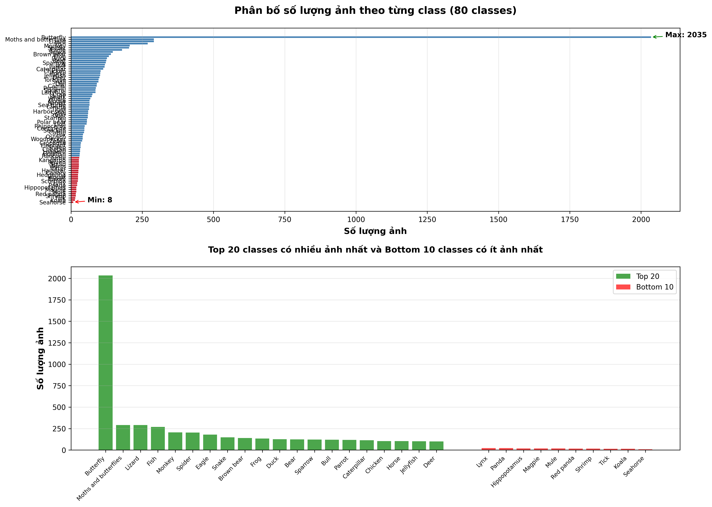

# CHECKLIST HOÀN THIỆN DỰ ÁN

## ✅ ĐÃ HOÀN THÀNH

- [x] Báo cáo đầy đủ với 12 phần
- [x] Thêm mục lục vào báo cáo
- [x] Thêm lời cảm ơn
- [x] Sửa inconsistency về imbalance ratio
- [x] Cập nhật README.md
- [x] Tạo file slide thuyết trình (21 slides)
- [x] Tạo script vẽ biểu đồ phân bố classes
- [x] Tạo script vẽ biểu đồ training results

---

## 📋 CHECKLIST TRƯỚC KHI NỘP

### 1. Báo cáo (BAO_CAO.md)

#### Nội dung
- [x] Trang bìa đầy đủ
- [x] Mục lục
- [x] Lời cảm ơn
- [x] Tất cả 12 phần đầy đủ
- [x] Số liệu chính xác
- [x] Tài liệu tham khảo

#### Hình ảnh minh họa
- [x] **Hình 6.1 & 6.2**: Biểu đồ phân bố classes
  - ✅ Đã chạy: `python code_train_model/visualize_class_distribution.py`
  - ✅ Đã thêm file `class_distribution.png` và `class_categories.png` vào báo cáo
  - ✅ Đã di chuyển vào thư mục `images/`

- [x] **Hình 7.1**: Biểu đồ Loss Curves và Metrics
  - ✅ Đã chạy: `python code_train_model/visualize_training_results.py`
  - ✅ Đã thêm file `training_results.png` vào báo cáo
  - ✅ Đã di chuyển vào thư mục `images/`

- [ ] **Hình 8.1-8.3**: Ví dụ kết quả detection
  - ⏳ Chụp screenshot từ web app (Người dùng sẽ tự làm)
  - ✅ Đã chuẩn bị placeholder trong báo cáo

#### Kiểm tra
- [ ] Kiểm tra lỗi chính tả
- [ ] Kiểm tra format nhất quán
- [ ] Kiểm tra số liệu khớp với file kết quả
- [ ] Cập nhật ngày nộp

---

### 2. Slide thuyết trình (SLIDE_THUYET_TRINH.md)

#### Nội dung
- [x] 21 slides đầy đủ
- [x] Tập trung vào data preparation và demo
- [x] Cấu trúc logic

#### Hình ảnh minh họa
- [ ] **Slide 7**: Biểu đồ phân bố classes
  - Sử dụng `class_distribution.png` hoặc `class_categories.png`

- [ ] **Slide 12**: Biểu đồ so sánh baseline
  - Sử dụng `training_results.png`

- [ ] **Slide 16**: Screenshot giao diện web app
  - Chụp khi web app đang chạy
  - Show đầy đủ các thành phần

- [ ] **Slide 17**: Ví dụ kết quả detection
  - Ảnh có nhiều detections
  - Ảnh đơn giản
  - Có thể thêm ảnh khó để so sánh

#### Chuẩn bị
- [ ] Tạo PowerPoint/Google Slides từ nội dung
- [ ] Thêm hình ảnh vào các slide
- [ ] Practice thuyết trình 2-3 lần
- [ ] Đảm bảo thời gian ≤ 15 phút
- [ ] Chuẩn bị trả lời câu hỏi

---

### 3. Code và Scripts

#### Scripts visualization
- [x] `visualize_class_distribution.py` - Vẽ biểu đồ phân bố classes
- [x] `visualize_training_results.py` - Vẽ biểu đồ training results

#### Chạy scripts
- [x] Chạy `visualize_class_distribution.py`:
  ```bash
  cd code_train_model
  python visualize_class_distribution.py
  ```
  - ✅ Đã tạo file `class_distribution.png` và `class_categories.png`
  - ✅ Đã di chuyển vào thư mục `images/`

- [x] Chạy `visualize_training_results.py`:
  ```bash
  cd code_train_model
  python visualize_training_results.py
  ```
  - ✅ Đã tạo file `training_results.png`
  - ✅ Đã di chuyển vào thư mục `images/`

#### Web app
- [ ] Test web app hoạt động tốt
- [ ] Chụp screenshots giao diện
- [ ] Test với một số ảnh và chụp kết quả

---

### 4. Kiểm tra tổng thể

#### Tính nhất quán
- [ ] Số liệu trong báo cáo khớp với file kết quả
- [ ] Số liệu trong slide khớp với báo cáo
- [ ] Tên đề tài nhất quán ở tất cả nơi

#### Format
- [ ] Tất cả bảng có format nhất quán
- [ ] Số thập phân được format đúng (4 chữ số)
- [ ] Đơn vị rõ ràng (%, ms, etc.)

#### Chất lượng
- [ ] Không có lỗi chính tả
- [ ] Câu văn rõ ràng, dễ hiểu
- [ ] Sơ đồ và biểu đồ rõ ràng

---

## 🎯 HƯỚNG DẪN THỰC HIỆN

### Bước 1: Tạo biểu đồ

```bash
cd code_train_model

# Cài đặt matplotlib nếu chưa có
pip install matplotlib

# Tạo biểu đồ phân bố classes
python visualize_class_distribution.py

# Tạo biểu đồ training results
python visualize_training_results.py
```

**Kết quả:**
- `class_distribution.png` - Biểu đồ phân bố tất cả classes
- `class_categories.png` - Biểu đồ phân loại classes
- `training_results.png` - Biểu đồ metrics và loss curves

### Bước 2: Chụp screenshots web app

1. Khởi động backend và frontend
2. Mở http://localhost:3000
3. Chụp screenshot:
   - Giao diện chính (Slide 16)
   - Kết quả detection với nhiều objects (Slide 17)
   - Kết quả detection đơn giản (Slide 17)

### Bước 3: Thêm hình ảnh vào báo cáo

1. Copy các file PNG vào thư mục `images/` (tạo nếu chưa có)
2. Thêm vào báo cáo:
   ```markdown
   
   ```

### Bước 4: Thêm hình ảnh vào slide

1. Mở PowerPoint/Google Slides
2. Thêm hình ảnh vào các slide tương ứng
3. Đảm bảo hình ảnh rõ ràng, dễ nhìn

### Bước 5: Practice thuyết trình

1. Luyện tập 2-3 lần
2. Đảm bảo thời gian ≤ 15 phút
3. Chuẩn bị trả lời câu hỏi về:
   - Tại sao chọn YOLOv8n?
   - Pipeline xử lý dữ liệu
   - Kết quả và cải thiện
   - Demo ứng dụng

---

## 📝 GHI CHÚ

- Tất cả hình ảnh nên có độ phân giải cao (300 DPI)
- Đảm bảo hình ảnh rõ ràng khi in hoặc trình chiếu
- Kiểm tra kỹ trước khi nộp

---

**Chúc bạn thành công! 🎉**

